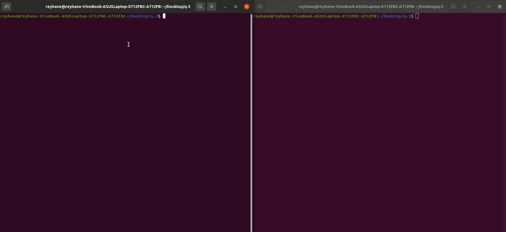

# ChatRoom
simple chat room using python and socket programming.  
in this project two person can chat together and send and receive messages.  
# Requirement
* python 3.x
# Usage
  
## Support

**Contact me @:**

e-mail:

* r.abtahi1378@gmail.com

Telegram id:

* [@ReyhaneAbthai](https://t.me/ReyhaneAbtahi)

## License
[MIT](https://github.com/fark00/Serial-Transmitter-Receiver/blob/master/LICENSE)
&#0169; 
